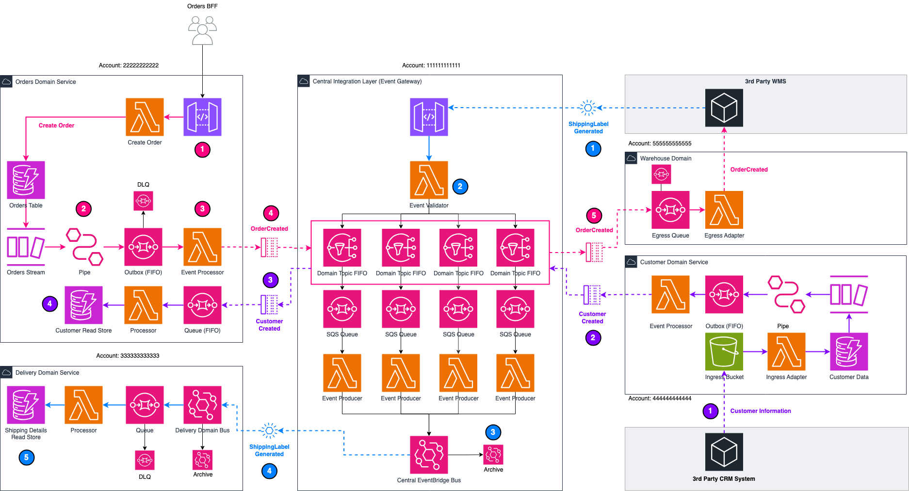

# Serverless Domain Adapters - Part 2


In part 2 of this series, we cover serverless domain adapters for your central integration layer, with examples written in TypeScript and the AWS CDK.

The article for part 1 can be found here: https://medium.com/@leejamesgilmore/serverless-domain-adapters-c17d7e3ebd3e

The article for part 2 can be found here: https://medium.com/@leejamesgilmore/serverless-integration-layer-domain-adapters-part-2-87266258c557



## Deploying the Solution

To deploy the solution you will need to deploy the solutions in the following order

1. central-integration-layer
2. delivery-service
3. order-service
4. customer-service

> Note: Tearing down needs to be in the opposite order to the deploy order.

### Config

In each of the `.\bin` files please change the relevant config for your AWS accounts e.g.

```
// aws domain account lookups
const enum domainAccountIds {
  'central' = '111111111111',
  'delivery' = '222222222222',
  'orders' = '333333333333',
  'warehouse' = '444444444444',
  'org' = 'o-1234abcd',
}
```

### Deploying

In each of the service folders run `npm run deploy`

> Note: There are costs associated with running the solution and this is non production ready as an example only.
